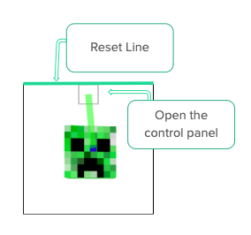
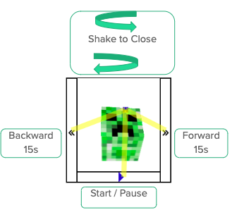

# Media Head Controller
In the modern society, online tutorials on Youtube enable us to learn whenever and whatever we want. Furthermore, these videos allow us to control the flow of learning if instructions were unclear or hard to comprehend. However, we are most likely need to stop what we were doing in order to free our hands to pause or rewind the video. For example, if we are following a cooking tutorial, we need to put down the knife, wash our hands, and wipe them dry every time before we can comfortably control the video. Especially, most tutorials speed up or skip the waiting time to condense the content; therefore, we need to pause and rewind even more. 

We provide a solution. Our project allows a user to control the flow of the video without using his hands. We project the movement of the user's head into a 2D plane. The user can use the cursor on the screen to play, pause, fast forward and rewind the video. 

Video of how to use this program:
[https://youtu.be/xsqti5juf1c](https://youtu.be/xsqti5juf1c)

created by:  
Ray Lin 75224483 
Qiuyang Que 905231227 
 
## Build and Run this program
### Build
first clone the repository to local folder
`git clone https://github.com/superraylin/Media-Head-Controller.git` 
make sure Node.js is installed  
Run `npm start` in the folder

### Run
After the program is compiled successfully,  
Open `host.command` if you are using MaxOS, or open `host.bat` if you are using Windows.
(If the access of above files is denied, try `chmod 777 host.command` or `chomod 777 host.bat`)  
Open chrome, and type `localhost:8000` in the address bar.        

## Commands detail
**change youtube videos**  

 
 
### Default screen
 
**Open Control Box:** Move cursor to the upper middle square    

 
 
**Reset cursor postion (x-axis):** Move cursor to the reset line (upper line) and wait for few seconds (all black feedback line is gone) 

 
 
 
### Control Screen
 
**Pause/ Play Video:**
Move cursor to the bottom box 
 
 
**Forward/ Backward 15 seconds:**
Move cursor to the right/left box 

 
 
**Close Control Screen:**
Slightly shake your head without touching the left/right box.  

 
 

### Feedforward Color code:
**Green:** When only one command is possible.  
**Yellow:** Multiple possible command. 
**Red:** Move to that direction to close control screen, triggered only when the cursor are close to left or right side
 
 
## Acknowledgment and Citation
This project is building on top of this repository [mjyc/head-pose-estimation-demo](https://github.com/mjyc/head-pose-estimation-demo)  
Graphic library (tiny-graphics.js and dependencies.js) is provided by UCLA CS-174A, older version of this repository [tiny-graphics](https://github.com/encyclopedia-of-code/tiny-graphics-js)
